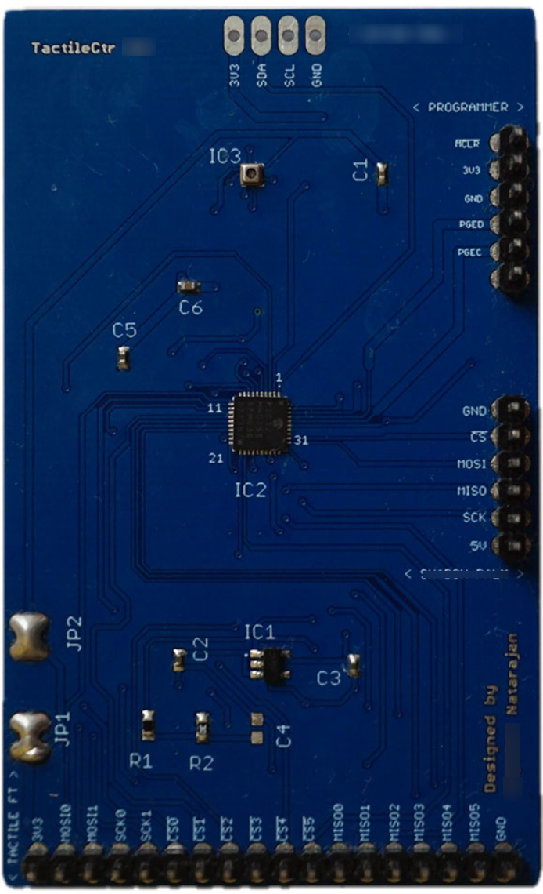

# Tactile Controller Module

The **Tactile Controller Module** is a compact, high-performance interface board powered by the **PIC32MM0256GPM036** microcontroller in a UQFN 40-pin package. It is designed to sample and manage data from high-density tactile sensor arrays and enables flexible communication using I²C, hardware SPI (HW SPI), and software SPI (SW SPI) protocols.

## Features

- **Microcontroller:** PIC32MM0256GPM036 (UQFN-40)  
- **Protocols Supported:**
  - I²C  
  - Hardware SPI (HW SPI)  
  - Software SPI (SW SPI)  
- **Application:** 
  - Interfaces with high-density tactile sensor arrays  
  - Suitable for applications requiring customizable sampling and interfacing logic  

## Use Case

The module is primarily used to sample sensor data from high-density tactile controllers, which can be interfaced using the software SPI protocol. Ideal for robotics, touch-sensitive interfaces, or pressure-mapping applications.

## Board Images

**Populated Module**  

**Board Layout**  

**Schematics**  

## Additional Details

- **Pin headers** are provided for programming the MCU and interfacing with external sensors and components.  
- **Low-power operation** and compact form factor make it ideal for embedded systems and portable tactile solutions.  
- Firmware development and sensor interfacing can be customized based on specific application needs.
